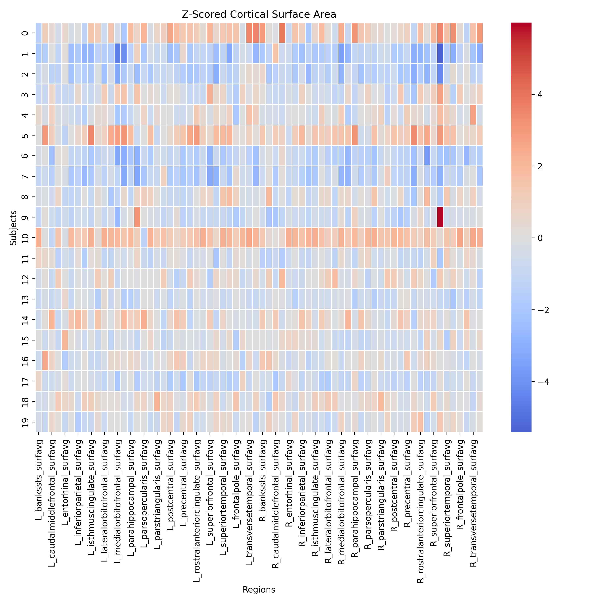
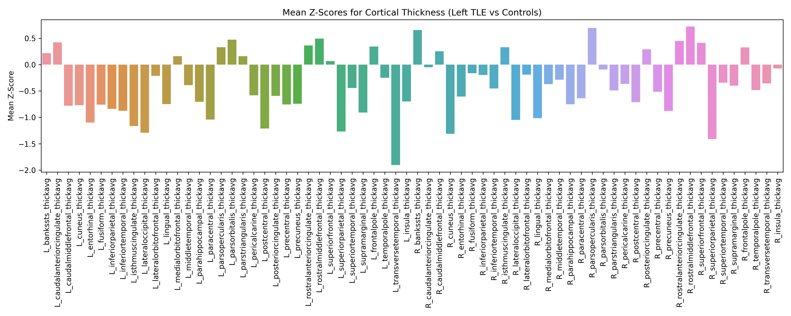

# Voxel-based morphometry Enigma Toolbox

### Description

I designed this code to process and visualise neuroimaging data from the ENIGMA repository. ENIGMA stands for the Enhancing Neuro Imaging Genetics through Meta Analysis.is an international effort by leaders worldwide. The Consortium brings together researchers in imaging genomics, neurology and psychiatry, to understand brain structure and function, based on MRI, DTI, fMRI, genetic data and many patient populations (https://enigma.ini.usc.edu/).
The code primarily does the following:
1. **Loading Example Data:** It makes use of the `enigmatoolbox` library to load example datasets. This toolbox provides utilities specific to the ENIGMA data processing.
   
2. **Data Transformation:** The subcortical data is reordered for clarity, and then the data is z-scored, essentially standardizing it to have a mean of 0 and a standard deviation of 1. This helps in making direct comparisons and visualisations more meaningful.
   
3. **visualisation:** The visualisations are the crux of the code. They include:
   - **Heatmaps** to represent z-scored data for different brain metrics like Subcortical Volumes, Cortical Thickness, and Cortical Surface Area.
   - **Mean Z-Scores Bar Plots** to represent average z-scores for specific conditions. For instance, it calculates mean z-scores for the Left Temporal Lobe Epilepsy (TLE) condition.
   - **Boxplots** that allow for comparisons of specific brain structures between different groups.
     
4. **Mosaic Creation:** One of the notable features of the code is that after generating individual plots, it combines these plots into a mosaic image. This is particularly useful for presenting or sharing the visualisations in a consolidated manner.

5. **Data Saving:** The processed datasets and the derived mean z-scores are saved as CSV files for any further analyses or sharing.

# ENIGMA Neuroimaging Data visualisation

This repository contains code that processes and visualises neuroimaging data from the ENIGMA initiative. 

## Introduction
The ENIGMA consortium is an international effort by leaders worldwide. The network brings together researchers in imaging genomics, neuroinformatics, and medical genomics to understand brain structure and function, based on MRI, DTI, fMRI, genetic data and many patient populations.

## Features of the Code:
- **Load Sample Data** from the ENIGMA dataset.
- **Transform Data** to standardize and make it suitable for analysis.
- **Generate visualisations** such as:
  - Heatmaps
  - Mean Z-Scores Bar Plots
  - Boxplots for brain structures comparisons
- **Create Mosaic Images** by consolidating the individual plots.
- **Save Processed Data** and visualisations for further analysis.

## Dependencies:
- `matplotlib`
- `seaborn`
- `enigmatoolbox`
- `PIL`

